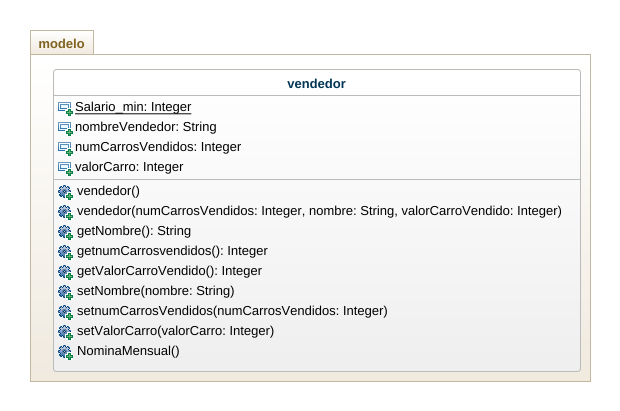

## QUIZ

Elaborar el diagrama de clases para el siguiente problema:

El sueldo que perciben los vendedores de una empreza automotriz está integrado de la siguiente manera: 

 -Salario minimo

 -$100000 por cada carro vendido

 -2% del valor de los carros vendidos 

Se tienen varios vendedores, y por cada vendedor se tiene el nombre y el precio de cada carro que vendio durante el mes. Es posible que algunos vendedores no hayan realizado venta alguna, en tal caso solo se tendria el nombre.

Elaborar un programa que permita leer los datos e imprimir el reporte de nomina.

